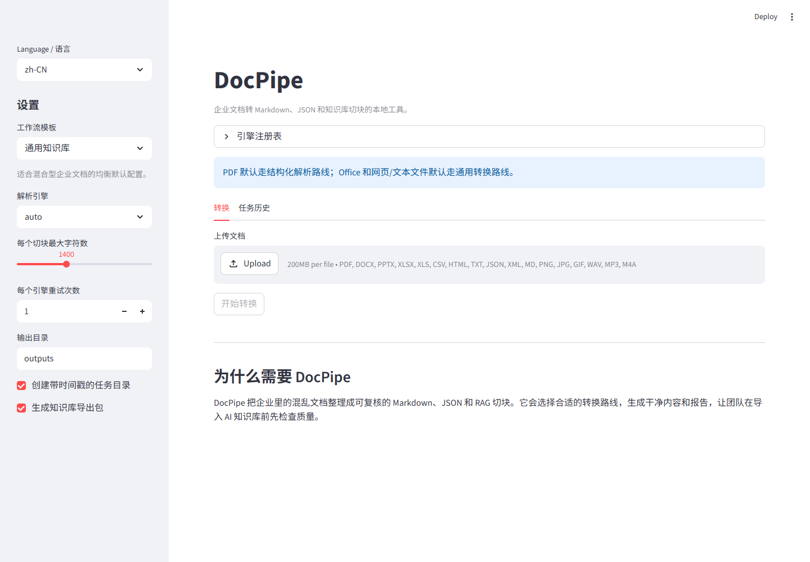

# DocPipe

DocPipe turns messy company documents into clean, reviewable knowledge-base imports for
Dify, FastGPT, RAGFlow, Coze, and custom RAG systems.

It is built for teams that have folders full of PDFs, Word files, spreadsheets, manuals,
policies, and FAQs, but need structured Markdown, JSON, chunks, reports, and import packs
before those files are safe to load into an AI assistant.



## Why It Matters

- Convert mixed document folders in one local workflow
- Route each file through the best available parser adapter
- Generate Markdown, JSON metadata, and RAG-ready chunks
- Flag risky conversions before they enter a knowledge base
- Apply workflow templates for policy, support, and product-manual projects
- Export starter packs for common knowledge-base tools
- Package reports and exports into one handoff ZIP
- Keep enterprise files local by default

## Quick Demo

Use Python 3.11 or 3.12. Some document AI dependencies may lag behind the newest Python
releases.

```powershell
cd docpipe
python -m venv .venv
.\.venv\Scripts\Activate.ps1
python -m pip install -e ".[dev]"
docpipe demo
```

Windows shortcut:

```powershell
scripts\run_demo.ps1
```

The demo converts files in `samples/` and writes a complete output bundle to
`outputs/demo/`.

See `docs/demo-result-preview.md` for an example report generated from the included
sample files.

## What The Demo Produces

| Output | Purpose |
| --- | --- |
| `*.md` | Clean Markdown for review |
| `*.json` | Per-file metadata, chunks, and quality metrics |
| `conversion_report.md` | Human-readable batch report |
| `conversion_report.json` | Machine-readable batch report |
| `rag_chunks.jsonl` | Vendor-neutral chunk file |
| `exports/dify_chunks.csv` | Starter import file for Dify |
| `exports/fastgpt_chunks.jsonl` | Starter import file for FastGPT/custom adapters |
| `exports/ragflow_chunks.jsonl` | Starter import file for RAGFlow/custom adapters |
| `exports/review_checklist.md` | Files that need manual review |
| `exports/handoff_guide.md` | Template-specific customer handoff guide |
| `exports/docpipe_export_pack.zip` | Portable handoff bundle |

## Run The Web App

```powershell
python -m streamlit run src/docpipe/web.py
```

Or use:

```powershell
scripts\run_web.ps1
```

The web app supports multi-file upload, parser selection, quality metrics, Markdown
preview, chunk inspection, job history, export ZIP download, and review checklist download.

## Run The CLI

```powershell
docpipe convert .\samples --output .\outputs --engine auto
```

Useful commands:

```powershell
docpipe demo
docpipe engines
docpipe templates
docpipe history --output .\outputs
```

## Routing Strategy

| File type | Default route | Why |
| --- | --- | --- |
| PDF | Structure-aware adapter | Better layout, tables, reading order, and structured output |
| Word / Excel / PowerPoint | General document adapter | Fast Office-to-Markdown conversion |
| HTML / text / CSV / JSON | General text adapter | Lightweight text extraction |
| Unknown | Broad adapter first, fallback when available | Better compatibility across mixed folders |

## Quality Signals

DocPipe adds conservative checks that help teams review risky conversions before import:

- empty or very short output
- possible encoding noise
- replacement characters
- long documents without headings
- oversized or tiny chunks
- possible table loss
- repetitive lines

These checks do not claim semantic correctness. They create a practical review queue so
humans can inspect the files most likely to hurt knowledge-base quality.

## Commercial Use Cases

- Internal AI assistant knowledge-base preparation
- Customer support FAQ cleanup
- Contract and policy document migration
- Product manual and training material ingestion
- Agency-led document cleanup for client RAG projects
- Private local deployment for sensitive enterprise files

## Deployment And Validation

- `docs/demo-walkthrough.md`: 3-minute product walkthrough
- `docs/demo-result-preview.md`: example output from the included demo
- `docs/industry-templates.md`: workflow templates for repeatable customer delivery
- `docs/deployment.md`: Windows and Docker deployment notes
- `docs/validation.md`: real-document validation checklist
- `docs/smoke-test.md`: latest local smoke-test result
- `docs/adapter-architecture.md`: parser adapter design

Docker quick start:

```powershell
docker compose up --build
```

## License

This project is MIT licensed. DocPipe uses third-party open-source dependencies; see
`THIRD_PARTY_NOTICES.md` and each dependency's package metadata for license details.
