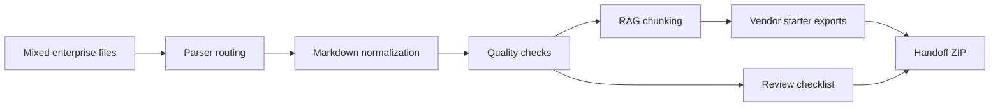

# DocPipe

[](https://github.com/Lackylu7/docpipe/actions/workflows/ci.yml)


**Turn messy company documents into reviewable AI knowledge-base import packs.**

DocPipe is a local-first document preprocessing workbench for teams building internal AI
assistants, RAG systems, Dify/FastGPT/RAGFlow/Coze knowledge bases, or client document
cleanup workflows.

It takes folders full of PDFs, Word files, spreadsheets, manuals, policies, support FAQs,
HTML pages, and plain text, then produces Markdown, JSON metadata, RAG chunks, quality
reports, review checklists, handoff guides, and a ZIP export bundle.


## Why DocPipe

Most companies do not have a clean knowledge-base problem. They have a messy document
problem:

- important files are scattered across Word, PDF, Excel, HTML, CSV, and Markdown
- conversion quality is hard to trust
- tables, headings, and section boundaries can break during ingestion
- sensitive files should stay inside a private environment
- AI teams still need import files, review lists, and handoff notes

DocPipe adds the product workflow around document parsers:

- batch conversion through a local Web UI or CLI
- automatic parser routing with retry/fallback support
- Markdown and JSON output for every source file
- RAG-ready `jsonl` chunks with source metadata
- quality scoring and review warnings
- workflow templates for policies, support FAQs, and product manuals
- Chinese and English UI/output
- export packs for Dify, Coze, FastGPT, RAGFlow, and custom RAG systems
- customer handoff ZIP with reports and review guides

## Quick Start

Use Python 3.11 or 3.12.

```powershell
git clone https://github.com/Lackylu7/docpipe.git
cd docpipe
python -m venv .venv
.\.venv\Scripts\Activate.ps1
python -m pip install -e ".[dev]"
docpipe demo --language zh-CN
```

Windows shortcut:

```powershell
scripts\run_demo.ps1
```

Open the Web workbench:

```powershell
python -m streamlit run src/docpipe/web.py
```

Then visit the local URL shown by Streamlit, usually `http://127.0.0.1:8501`.

## What You Get

| Output | What it is for |
| --- | --- |
| `*.md` | Clean Markdown for human review and AI ingestion |
| `*.json` | Per-file metadata, chunks, source profile, engine, score, and warnings |
| `conversion_report.md` | Human-readable conversion report |
| `conversion_report.json` | Machine-readable batch report |
| `rag_chunks.jsonl` | Vendor-neutral RAG chunk file |
| `exports/dify_chunks.csv` | Starter import file for Dify |
| `exports/coze_chunks.csv` | Starter import file for Coze |
| `exports/fastgpt_chunks.jsonl` | Starter import file for FastGPT/custom adapters |
| `exports/ragflow_chunks.jsonl` | Starter import file for RAGFlow/custom adapters |
| `exports/review_checklist.md` | Files that need manual review before import |
| `exports/handoff_guide.md` | Template-specific customer handoff guide |
| `exports/docpipe_export_pack.zip` | Portable bundle for delivery or archive |

Example output preview: [docs/demo-result-preview.md](docs/demo-result-preview.md)

## Web UI

The Web workbench supports:

- Chinese / English language switch
- workflow template selection
- parser engine selection
- multi-file upload
- chunk-size and retry settings
- conversion metrics
- review warnings
- Markdown preview
- chunk table inspection
- job history
- export ZIP download
- review checklist and handoff guide download

## CLI

```powershell
docpipe demo --language zh-CN
docpipe convert .\samples-cn --workflow-template enterprise-policy --language zh-CN
docpipe templates --language zh-CN
docpipe engines
docpipe history --output .\outputs
scripts\run_checks.ps1
```

## Workflow Templates

Templates help turn a generic converter into a repeatable delivery workflow.

| Template | Best for | Default chunk size |
| --- | --- | ---: |
| `general` | mixed company folders | 1400 |
| `enterprise-policy` | HR policies, SOPs, compliance manuals, internal rules | 1100 |
| `support-faq` | ticket exports, help-center pages, FAQ cleanup | 900 |
| `product-manual` | manuals, onboarding guides, release notes, training material | 1600 |

Each template adjusts the default chunk size and writes template-specific review focus
and handoff steps into `exports/handoff_guide.md`.

More details: [docs/industry-templates.md](docs/industry-templates.md)

## How It Works



DocPipe currently uses production parser adapters for broad document conversion and
structure-aware parsing. Planned adapter slots are available for additional engines such
as Unstructured, MinerU, and Marker.

Adapter design: [docs/adapter-architecture.md](docs/adapter-architecture.md)

## DocPipe vs. MarkItDown / Docling

DocPipe does not try to replace strong open-source parsers. It adds the enterprise
workflow layer around them.

| Need | MarkItDown | Docling | DocPipe |
| --- | --- | --- | --- |
| Convert one file to Markdown | Yes | Yes | Yes |
| Batch folder workflow | Basic/manual | Basic/manual | Yes |
| Web workbench | No | No | Yes |
| Quality scoring | No | No | Yes |
| Review checklist | No | No | Yes |
| RAG chunks with metadata | No | Partial/custom | Yes |
| Dify/Coze/FastGPT/RAGFlow starter exports | No | No | Yes |
| Chinese handoff guide | No | No | Yes |
| Customer delivery ZIP | No | No | Yes |

Third-party notices: [THIRD_PARTY_NOTICES.md](THIRD_PARTY_NOTICES.md)

## Supported Inputs

DocPipe is designed for mixed enterprise folders. Current supported extensions include:

`pdf`, `docx`, `pptx`, `xlsx`, `xls`, `csv`, `html`, `htm`, `txt`, `json`, `xml`, `md`,
`png`, `jpg`, `jpeg`, `gif`, `wav`, `mp3`, and `m4a`.

Actual quality depends on source-file complexity and the selected parser route. Complex
scanned PDFs, image-heavy documents, and table-heavy files should always be reviewed.

## Local-First Deployment

DocPipe is local-first by default. Files are processed on the machine or private server
where you run the tool.

Docker quick start:

```powershell
docker compose up --build
```

Deployment notes: [docs/deployment.md](docs/deployment.md)

## Documentation

| Document | Purpose |
| --- | --- |
| [docs/demo-walkthrough.md](docs/demo-walkthrough.md) | 3-minute product walkthrough |
| [docs/demo-result-preview.md](docs/demo-result-preview.md) | committed sample output preview |
| [docs/industry-templates.md](docs/industry-templates.md) | workflow template guide |
| [docs/localization.md](docs/localization.md) | Chinese and English support |
| [docs/commercial-delivery.md](docs/commercial-delivery.md) | service-led delivery notes |
| [docs/validation.md](docs/validation.md) | real-document validation checklist |
| [docs/smoke-test.md](docs/smoke-test.md) | latest smoke-test notes |
| [docs/roadmap.md](docs/roadmap.md) | near-term product direction |
| [CHANGELOG.md](CHANGELOG.md) | version history |

## Current Status

DocPipe is an MVP suitable for local demos, pilots, and service-led document cleanup
workflows. It is not yet a full SaaS platform.

Good fit today:

- preparing internal policy documents for a private AI assistant
- cleaning support FAQs before RAG import
- turning product manuals and training docs into reviewable chunks
- delivering a structured import pack to a customer

Not the focus yet:

- Markdown-to-Word/PDF/PPT reverse conversion
- full user management and billing
- automatic production import into every vendor platform
- cloud storage
- custom OCR model training

## License

DocPipe is MIT licensed. It integrates third-party open-source dependencies; see
[THIRD_PARTY_NOTICES.md](THIRD_PARTY_NOTICES.md) and each dependency's package metadata
for license details.
